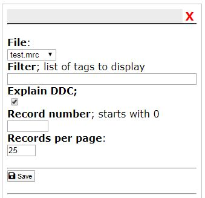
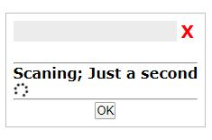
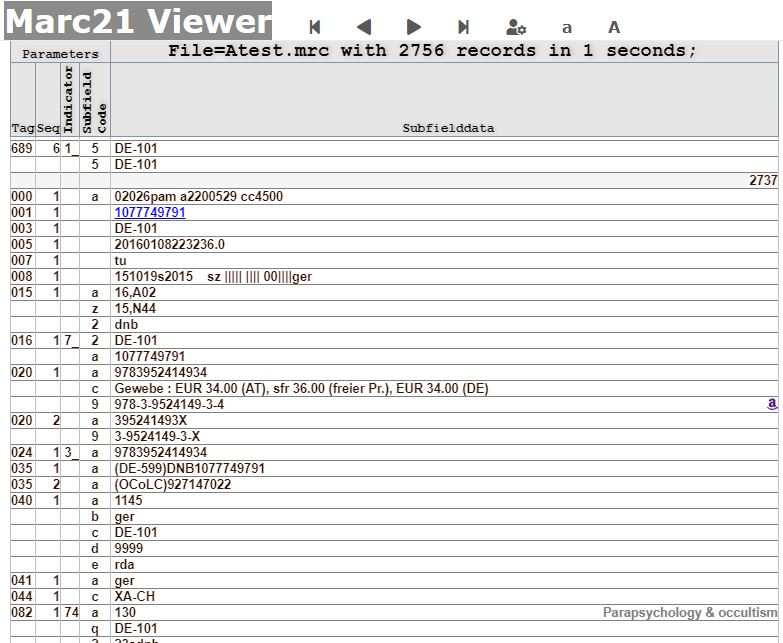

# Web application to browse through marc21 files

## MARC 21 ?

MARC 21. MARC (MAchine-Readable Cataloging) standards are a set of digital formats  
for the description of items catalogued by libraries, such as books. ...  
By 1971, MARC formats  had become the US national standard for dissemination of  
bibliographic data. Two years later, they became the international standard.27.02.2020

See also https://www.loc.gov/marc/faq.html

## Demo

a demo of the viewer is located on my webspace http://www.hgsweb.de/marc21Viewer  

## Installation

In your web root create a directory named **marc21Viewer**, for instance.    
Move all files into that directory .   
Thats it !

### Dependencies

Im using fontawesome here via <link> 

## Note

The example marc21 files are received from the GERMAN NATIONAL LIBRARY therefore  
the link generated for the value, control number, of TAG '001' will lead you to  
the relate entry within the website of the GERMAN NATIONAL LIBRARY. 

If you want to change this, look in source *makeMarcPage.php* for function *checkForUri*. 

## Using

Point your web browser at marc21Viewer like **http://..your host here../marc21Viewer/viewer/**  

#### This will open the settings dialog.

Here you can enter what files to browse.   
The example marc21 fiels are located in **../mrc**

* Atest.mrc
* Btest.mrc
* test.mrc

If you want to browse other marc21 files, move or upload your files
into **../mrc** .  

You can also filter for  **TAGs** . If this field is empty all tags within a  
record will be displayed. If you want to display only certain tags, enter these   
tag values as three digits like 020,100,084,245 into the given field.

You can also navigate to a specific record within the marc21 file.

Pressing 'save' the given file will be processed.  
This is indicated by a small modal dialog.

#### Finaly you will be presented with the first page of records.

With the arrows on top of the page you can go to the prevoius/next page or jump to the start or end of the marc21 file.  
From here you can also open the settings dialog and scale the font up or down.

